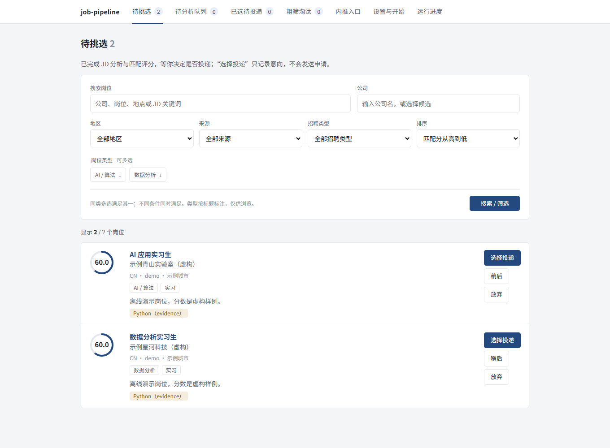

# Job Pipeline

**Keep job listings in one place, filter them by your requirements, and compare them with your experience using the AI model you choose.**

[English](README.en.md) · [简体中文](../README.md) · [Download v0.1.0](https://github.com/CercaTrovato/job-pipeline/releases/tag/v0.1.0) · [Ask an agent to install it](#agent-install)

## What does it do?

- Collect listings you paste in, or fetch them from configured job sites and company career pages.
- Group duplicate listings and keep their original links and explanations.
- Filter by your target city, graduation year, availability and internship duration.
- Compare job requirements with the experience you have reviewed and confirmed.
- Show the reasons behind each match, so you can choose, skip or revisit a job yourself.

The app runs on your computer and opens in a local browser window. You submit applications and contact employers yourself.

This screenshot uses fictional jobs and sample scores:



## Before you start

This is the **v0.1.0 public preview**. It is distributed as a Python package and requires **Python 3.11–3.13** on Windows, macOS or Linux. Use an existing compatible installation, or start with the [Python 3.13 installers](https://www.python.org/downloads/release/python-31316/). Python 3.14 and newer are not supported by this release.

You can try the offline demo **without a model or API key**. Configure a model when you want to analyze your own listings; configure sources when you want to collect jobs automatically.

<a id="agent-install"></a>
## Ask your agent to download and install it

Copy the prompt below into Codex, Claude Code or another agent that can work with local files, run commands or operate your computer. A chat website without access to your computer cannot perform the installation; use the manual instructions instead.

```text
Please download, install and open Job Pipeline on my computer.
Repository: https://github.com/CercaTrovato/job-pipeline
Release: https://github.com/CercaTrovato/job-pipeline/releases/tag/v0.1.0

Read README.md, AGENTS.md and docs/agent-setup.md first. Check my operating system and installed Python versions.
Use an existing Python 3.11–3.13 installation where possible. If Python is missing, obtain a compatible version
from an official source and install it in a user directory. Explain any system permission step I must complete.
Do not overwrite another project's Python environment or change the global PATH.

Create a separate virtual environment and workspace in my chosen directory, or a user directory with enough space.
Download job_pipeline-0.1.0-py3-none-any.whl and checksums.json from the v0.1.0 Release.
Verify the SHA-256 before installing. Stop if verification fails. Record the app, environment and data locations.

Run doctor --json and the offline demo, then start the local board and tell me which URL to open.
Do not collect real jobs, read my resume, contact anyone or submit applications.

If I want to configure a model, preserve any valid project settings first, then reuse compatible settings
from the agent I already use. Read only the necessary model, endpoint, protocol and credential references.
Do not change other tools' settings or expose login tokens. Subscription login tokens are not general API keys.
If credentials or login are missing, explain exactly what is needed. Do not register, purchase credits,
or switch billing methods on my behalf. If I ask you to configure and test a model, run just one minimal
request using fictional input, explain that it consumes a small amount of quota, and avoid batch calls.

Report whether installation succeeded, how to start and stop the app later, where files are stored,
and anything I still need to do.
```

This prompt installs the app and checks the demo. Once it is open, use the agent configuration button in **设置 / Settings** to copy a model setup prompt containing your actual workspace paths.

## Install it yourself

**No Python yet?** On the Python 3.13 page above, Windows users should choose **Windows installer (64-bit)** under Files and keep the Python Launcher (`py`) installed. macOS users should choose **macOS installer**. Linux users can install a compatible version through their distribution's package manager. Skip this step if you already have a supported version.

Check it with `py -3.13 --version` on Windows or `python3 --version` on macOS/Linux. If you already use Python 3.11 or 3.12, replace the Windows example's `-3.13` with that version; on macOS/Linux, `python3` should refer to a supported version.

Use `cd "your chosen folder"` in the terminal to select where to keep the environment, then run the commands for your system.

### Windows / PowerShell

```powershell
py -3.13 -m venv job-pipeline-env
.\job-pipeline-env\Scripts\python.exe -m pip install "https://github.com/CercaTrovato/job-pipeline/releases/download/v0.1.0/job_pipeline-0.1.0-py3-none-any.whl"
.\job-pipeline-env\Scripts\job-pipeline.exe start
```

### macOS / Linux

```bash
python3 -m venv job-pipeline-env
./job-pipeline-env/bin/python -m pip install "https://github.com/CercaTrovato/job-pipeline/releases/download/v0.1.0/job_pipeline-0.1.0-py3-none-any.whl"
./job-pipeline-env/bin/job-pipeline start
```

If Linux reports a missing `venv` or `ensurepip` component, install the component matching your Python version and retry. Ubuntu/Debian users running the system default Python can use `sudo apt install python3-venv`; a separately installed version needs its matching package, such as `python3.13-venv`. [Ubuntu documentation](https://ubuntu.com/developers/docs/howto/python-setup/)

Your browser should open the local board. If it does not, open the URL printed in the terminal. Keep the terminal open while using the app and press **Ctrl+C** to stop the service.

To start it again, return to the same folder and run the last command. If the port is already in use, add `--port 5051`.

To install from [source](https://github.com/CercaTrovato/job-pipeline/releases/download/v0.1.0/job_pipeline-0.1.0.tar.gz), download and extract the archive, create a virtual environment in that folder, then use its Python to run `-m pip install .`. On Windows, use `.\job-pipeline-env\Scripts\python.exe -m pip install .`; on macOS/Linux, use `./job-pipeline-env/bin/python -m pip install .`. See [CONTRIBUTING.md](../CONTRIBUTING.md) for development instructions.

## What to do after opening it

The current app interface is in Simplified Chinese; these labels help you find each step.

1. **Try the demo:** open **设置 → 开始运行 → 导入离线演示** (Settings → Run → Import offline demo), then **待挑选** (Jobs to review). No model is called.
2. **Configure a model:** copy the agent setup prompt or use **手动配置模型** (Manual model setup). Connection tests consume a small amount of model quota.
3. **Review your experience:** upload a text-based PDF/Word resume or paste text, check what was extracted, then confirm which entries may be used for matching. Convert scanned PDFs to selectable text first.
4. **Add jobs:** paste a listing in **内推入口** (Manual job entry), or configure search terms and sources in **岗位来源** (Job sources).
5. **Run the analysis:** start a task in **开始运行** (Run), then inspect the results on the board. The default batch is three jobs; you can change the budget.

Scores help you organize and review jobs. They do not guarantee a suitable job or an interview.

## Can I use the model I already have?

| What you have | How it is used |
| --- | --- |
| An authenticated Codex CLI | Can run analysis automatically with a model available to your account. |
| An OpenAI, DeepSeek or Anthropic API account | Configure the endpoint, model and credential source, manually or with an agent. |
| Claude Code or another computer-capable agent | Can install and configure the app. This version does not use Claude Code subscription login as an automatic analysis backend; the manual task-packet workflow is also available. |
| No model access yet | Start with the offline demo, manual job entry and board, then configure a model later. |

API calls are billed by the provider you choose. A chat subscription does not necessarily include API credits. [Detailed configuration guide](agent-setup.md)

## Sources and data

Adapters are included for Boss, Nowcoder, LinkedIn, JobsDB and some company career pages. Collection is disabled by default. Browser-based sources require OpenCLI, its extension and your own platform login. [Source setup](sources.md)

Files are stored in your local user data directory. If you use a cloud model, the relevant resume information you confirm and the job text are sent to that provider. The resume preview masks common sensitive fields; check it for names or other information you want to remove. Credentials use environment variables, the system credential store or the current service session.

To choose another data folder, put `--workspace "folder"` before the command, for example `job-pipeline --workspace "my-jobs" start`. When using the virtual environment, keep using the full executable path shown above.

## Verification and support

The Windows browser flow has been tested. All **nine CI combinations** of Windows/macOS/Linux and Python 3.11/3.12/3.13 passed installation, offline tests, builds and demo checks. Real macOS/Linux browser sessions, API credentials and job-platform collection still need testing. [Verification record](PROGRESS.md)

Report problems in [Issues](https://github.com/CercaTrovato/job-pipeline/issues) with your operating system, steps to reproduce and a redacted error. Keep real resumes, credentials and workspace data out of reports.

## Search keywords

Job search, job tracker, resume matching, AI job assistant, internships, campus recruitment, local-first application.

求职工具、招聘信息整理、岗位看板、简历匹配、AI 求职助手、实习、校园招聘。

MIT license. You may modify, redistribute and use the software commercially while retaining the copyright and license notice.
